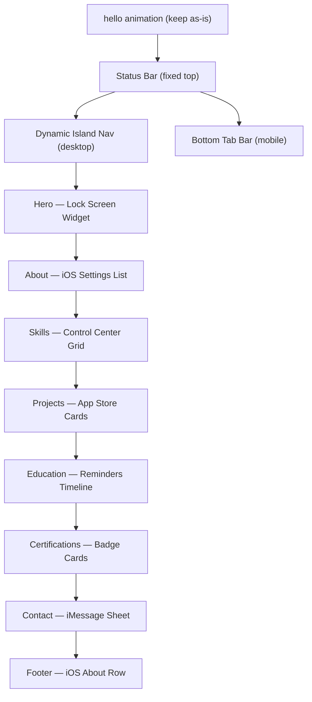

# iOS Design System Portfolio Rebuild

## Design Tokens (replaces current cyan/glow theme)

iOS dark mode palette in CSS variables:
- `--ios-bg`: `#000000` | `--ios-bg-2`: `#1C1C1E` | `--ios-bg-3`: `#2C2C2E`
- `--ios-separator`: `#3A3A3C`
- System accent colors: Blue `#0A84FF`, Green `#32D74B`, Cyan `#64D2FF`, Purple `#BF5AF2`, Orange `#FF9F0A`
- Typography: `font-family: -apple-system, BlinkMacSystemFont, "SF Pro Display", "SF Pro Text", "Helvetica Neue", sans-serif`
- Light mode overrides for `prefers-color-scheme` + manual toggle

---

## Component Map

---

## Section-by-Section Layout

### Status Bar
- Fixed, `height: 44px`
- Left: `time` (live clock)
- Right: battery icon + wifi icon (SVG, decorative)
- Blurs the content behind it (`backdrop-filter: blur(20px)`)

### Dynamic Island (desktop nav, replaces pill nav)
- Centered pill, `border-radius: 24px`, `background: #000`, `min-width: 120px`
- On hover/scroll: expands horizontally to reveal all 7 nav links
- Active section highlighted with iOS blue tint pill
- Profile photo + name appear on left when expanded
- Shrinks back to compact island when idle (CSS transition + JS `IntersectionObserver`)

### Bottom Tab Bar (mobile ≤ 768px)
- Fixed bottom, frosted glass, 5 tabs: Home / About / Skills / Work / More (…)
- "More" opens a slide-up sheet with Education, Certs, Contact links
- Active tab shows iOS blue icon + label

### Hero — Lock Screen Widget
- Full viewport, black bg
- Large SF display clock (live, top-center) — like iOS lock screen
- Profile photo: circular, 80px, ring glow
- Name: `font-size: clamp(3rem, 8vw, 6rem)`, heavy weight
- Roles typewriter (keep existing logic)
- Two "app icon"-style CTA buttons (frosted glass, rounded square, icon + label)
- Scroll indicator: iOS-style chevron chevron animation

### About — iOS Settings List
- Section title: `font-size: 13px, uppercase, letter-spacing: 0.08em` (iOS group header style)
- Card: `background: #1C1C1E`, `border-radius: 12px`, inset shadow
- Each highlight: row with SF symbol-style icon bullet, separator line between rows
- Stats: 3 rounded-rect mini widgets in a row (`#2C2C2E`, large number + label)

### Skills — Control Center Grid
- `display: grid; grid-template-columns: repeat(auto-fill, minmax(90px, 1fr))`
- Each skill: square module with rounded corners (like CC wifi/bluetooth toggle)
- Icon centered, name below, skill level as a thin arc progress ring (CSS `conic-gradient`)
- Active/hover: module lights up with the skill's devicon color

### Projects — App Store Cards
- Horizontal scroll row on mobile, 2-col grid on desktop
- Each card: `border-radius: 16px`, `background: #1C1C1E`
- Card header: color gradient banner (different per project), title + year badge
- Body: description, tech tags as SF-style rounded capsules
- Footer: GitHub / Live icons — pill buttons, iOS blue tint
- Hover: `transform: scale(1.02)` with subtle spring easing

### Education & Certifications — Reminders / Files Timeline
- Timeline dot: small filled circle, connecting vertical line
- Each item: `background: #1C1C1E` card, left-border accent in iOS green/purple/blue
- Degree as title, school as subtitle (muted), year badge right-aligned
- Hackathons: orange accent color

### Contact — iMessage-style
- "LET'S BUILD SOMETHING" heading kept (large Bebas Neue)
- Chat bubble layout: a sample "message bubble" from Deep with the email/phone
- "Send a message" button opens existing modal — restyled as iOS sheet (slides from bottom, `border-radius: 12px 12px 0 0`, handle bar at top)
- Modal inputs: iOS text field style — `background: #2C2C2E`, no border until focused

### Footer
- iOS "About" section style: small rows with label + value
- Email, phone, location in grouped list
- Copyright as muted caption

---

## Files Changed

- [`index.html`](index.html) — Full rebuild of HTML structure
- [`style.css`](style.css) — Replace entirely with iOS design tokens + component styles
- [`script.js`](script.js) — Keep `resumeData` and Three.js; rewrite all render functions, add Dynamic Island expand/collapse logic, bottom tab bar sheet, new GSAP scroll animations

## What is Preserved
- `resumeData` object (all portfolio content — zero data changes)
- "hello" SVG preloader animation (already done)
- GSAP + Three.js + Lenis CDN links
- Contact form AJAX logic (`initContactForm`)
- Theme toggle (dark/light)
- Existing `assets/` folder and `Resume/` folder paths
